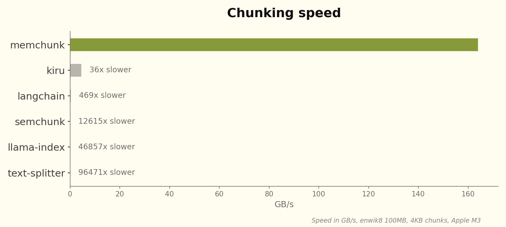

<p align="center">
  
</p>

<h1 align="center">⚡ memchunk ⚡</h1>

<p align="center">
  <em>The fastest text chunking library — up to 1TB/s throughput</em>
</p>

<p align="center">
  <a href="https://crates.io/crates/memchunk"></a>
  <a href="https://docs.rs/memchunk"></a>
  <a href="LICENSE-MIT"></a>
</p>

---

**memchunk** splits text into chunks at semantic boundaries (sentences, paragraphs) using SIMD-accelerated search. It's designed for RAG pipelines where you need to chunk massive amounts of text *fast*.

<p align="center">
  
</p>

<p align="center">
  <em>See <a href="benches/">benches/</a> for detailed benchmarks.</em>
</p>

## Installation

```bash
cargo add memchunk
```

## Usage

```rust
use memchunk::chunk;

let text = b"Hello world. How are you? I'm fine.\nThanks for asking.";

// With defaults (4KB chunks, split at \n . ?)
let chunks: Vec<&[u8]> = chunk(text).collect();

// With custom size
let chunks: Vec<&[u8]> = chunk(text).size(1024).collect();

// With custom delimiters
let chunks: Vec<&[u8]> = chunk(text).delimiters(b"\n.?!").collect();

// With both
let chunks: Vec<&[u8]> = chunk(text).size(8192).delimiters(b"\n").collect();
```

## Citation

If you use memchunk in your research, please cite it as follows:

```bibtex
@software{memchunk2025,
  author = {Minhas, Bhavnick},
  title = {memchunk: The fastest text chunking library},
  year = {2025},
  publisher = {GitHub},
  howpublished = {\url{https://github.com/chonkie-inc/memchunk}},
}
```

## License

Licensed under either of [Apache License, Version 2.0](LICENSE-APACHE) or [MIT license](LICENSE-MIT) at your option.
